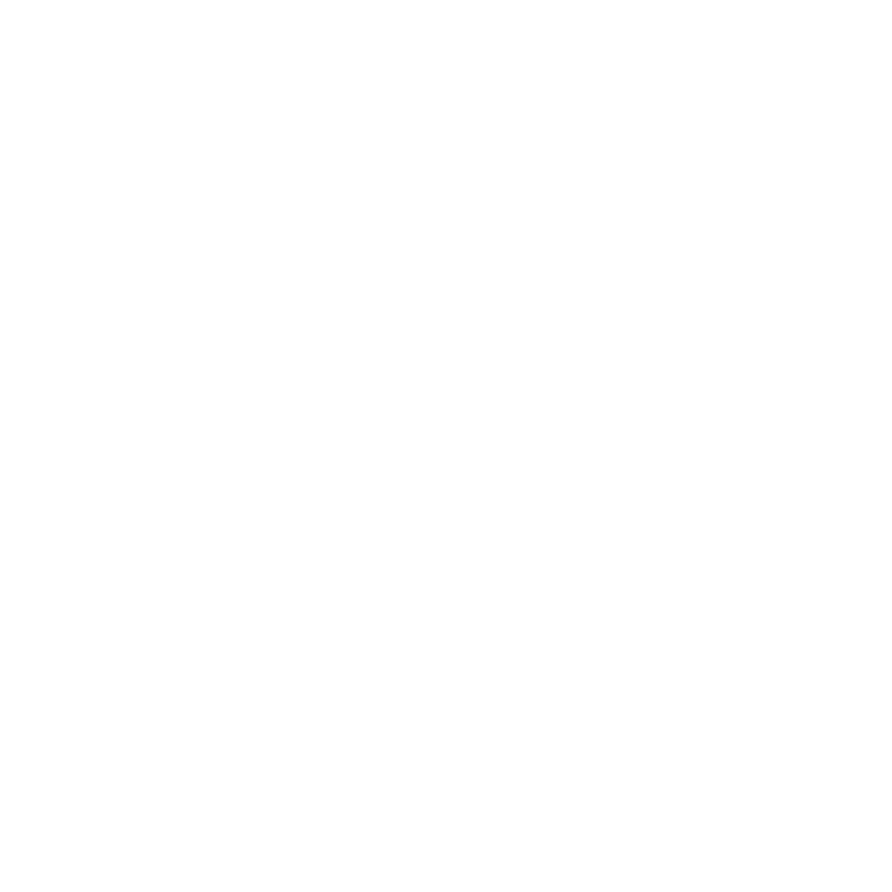

    <h1>
        
         
        Oxygen Base & Template
    </h1>

    

# 概述 (ZH, [EN](README.md))

本项目为 Oxygen Toolbox 基板和模板配置的版本控制。

# 关联项目

[API of Oxygen Toolbox](https://github.com/FatttSnake/oxygen-api)

[Web UI of Oxygen Toolbox](https://github.com/FatttSnake/oxygen-ui)

[Desktop Client of Oxygen Toolbox](https://github.com/FatttSnake/oxygen-desktop)

[Android Client of Oxygen Toolbox](https://github.com/FatttSnake/oxygen-android)
